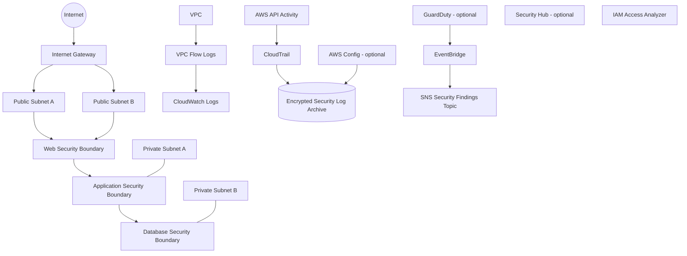

# AWS Cloud Security Engineering

[](https://github.com/KaffyDevelops/aws-cloud-security-engineering/actions/workflows/terraform-quality.yml)

> **Project type:** Independent cloud security engineering portfolio project  
> **Primary platform:** Amazon Web Services  
> **Infrastructure as Code:** Terraform  
> **Status:** Architecture and Terraform baseline prepared; deployment evidence pending

## Executive Summary

This project builds a security-focused AWS reference environment with Terraform. It is designed to demonstrate how cloud security controls fit together across identity, networking, logging, threat detection, configuration monitoring, encryption and infrastructure assurance.

The project deliberately separates **implemented-as-code** from **validated-in-AWS**. Terraform configuration and engineering documentation can be reviewed now, while runtime screenshots, findings and validation records are only added after the infrastructure is deployed and tested in an authorised AWS account.

## Security Objectives

The environment is designed to demonstrate the ability to:

- create segmented AWS network boundaries
- collect network and API activity for investigation
- protect audit logs from public exposure and encrypt them at rest
- enable account-level identity analysis
- integrate AWS-native threat detection and posture management
- route security findings into an alerting path
- document security decisions, limitations and cost trade-offs
- validate infrastructure changes through GitHub Actions before deployment

## Reference Architecture



The private subnets intentionally have **no NAT Gateway by default**. This avoids unnecessary recurring cost and creates an explicit no-internet-egress baseline. A future workload phase can add controlled egress only when the requirement is justified.

## Control Domains

| Domain | Controls represented |
|---|---|
| Identity | IAM Access Analyzer, role-based service permissions, no static CI credentials |
| Network | VPC, segmented public/private subnets, tiered security groups, controlled routing |
| Logging | CloudTrail, VPC Flow Logs, CloudWatch Logs, encrypted S3 archive |
| Detection | GuardDuty, EventBridge security finding routing |
| Posture | AWS Config and Security Hub optional controls |
| Data protection | KMS encryption, S3 public-access blocking, TLS-only bucket policy |
| Engineering assurance | Terraform fmt/validate, TFLint, GitHub Actions |

## Cost-Safe Design

Several AWS security services can generate charges. The Terraform therefore defaults to a conservative portfolio-development mode:

- no NAT Gateway
- GuardDuty disabled by default
- AWS Config disabled by default
- Security Hub disabled by default
- Access Analyzer enabled by default
- CloudTrail and VPC Flow Logs remain part of the baseline because auditability is central to the project

Review [`docs/cost-and-safety.md`](docs/cost-and-safety.md) before applying the configuration.

## Repository Structure

```text
aws-cloud-security-engineering/
├── .github/
│   └── workflows/
│       └── terraform-quality.yml
├── docs/
│   ├── architecture.md
│   ├── control-matrix.md
│   ├── cost-and-safety.md
│   ├── ci-authentication.md
│   ├── deployment-guide.md
│   ├── terraform-state-security.md
│   ├── threat-model.md
│   └── validation-plan.md
├── evidence/
│   └── README.md
├── scripts/
│   └── validate.sh
├── terraform/
│   ├── access-analyzer.tf
│   ├── backend.tf.example
│   ├── cloudtrail.tf
│   ├── config.tf
│   ├── detection.tf
│   ├── flow-logs.tf
│   ├── kms.tf
│   ├── locals.tf
│   ├── network.tf
│   ├── outputs.tf
│   ├── providers.tf
│   ├── security-groups.tf
│   ├── terraform.tfvars.example
│   ├── variables.tf
│   └── versions.tf
├── .gitignore
├── CONTRIBUTING.md
├── SECURITY.md
└── README.md
```

## Terraform Quick Start

```bash
cd terraform
cp terraform.tfvars.example terraform.tfvars
terraform init
terraform fmt -check -recursive
terraform validate
terraform plan
```

Do not run `terraform apply` until the AWS account, region, expected costs and cleanup plan have been reviewed.

## Current Validation Status

| Area | Status |
|---|---|
| Architecture | ✅ Documented |
| Terraform baseline | ✅ Prepared |
| Terraform CI | ✅ Prepared |
| AWS runtime deployment | ⏳ Pending |
| CloudTrail evidence | ⏳ Pending |
| Flow Logs evidence | ⏳ Pending |
| GuardDuty finding validation | ⏳ Pending |
| Security Hub posture validation | ⏳ Pending |
| Teardown evidence | ⏳ Pending |

No pending runtime item is presented as completed until evidence is captured from the authorised lab account.

## Engineering Roadmap

- [ ] Deploy the cost-safe baseline to an authorised AWS lab account
- [ ] Capture Terraform plan and apply evidence
- [ ] Validate CloudTrail delivery and log-file validation
- [ ] Validate VPC Flow Log delivery
- [ ] Enable and test GuardDuty deliberately
- [ ] Enable AWS Config and Security Hub for a controlled validation window
- [ ] Add AWS Config rule evidence
- [ ] Add EventBridge/SNS finding-routing evidence
- [ ] Add GitHub OIDC for credential-free AWS plan/deployment
- [ ] Move lab state to a dedicated encrypted remote backend
- [ ] Add Checkov security scanning after the baseline exceptions are reviewed
- [ ] Document `terraform destroy` and verify teardown

## Portfolio

Recruiter-facing case studies and wider cloud security work:

**https://kaffy.thecloudforge.app**

---

**Author:** Kafayat “Kaffy” Faniran  
**GitHub:** [@KaffyDevelops](https://github.com/KaffyDevelops)
